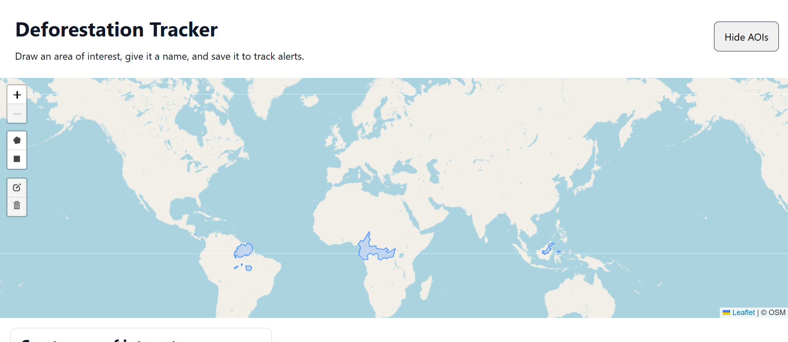
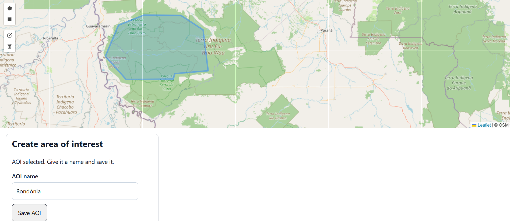
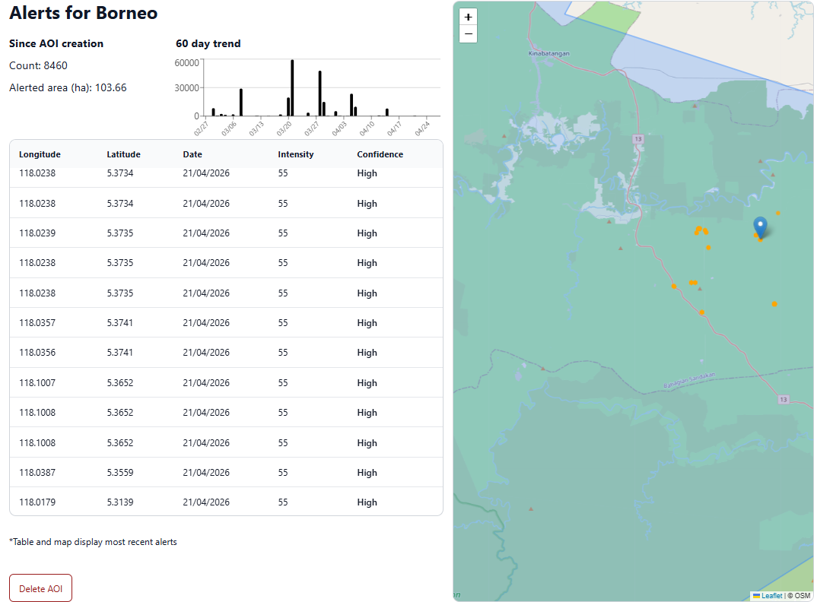

# Deforestation Alerts App

## Overview

A full-stack geospatial web application that allows users to draw and save Areas of Interest (AOIs) on an interactive map, then retrieve near real-time forest loss alerts for those areas using the Global Forest Watch API.

This project combines mapping, spatial databases, and external API integration to explore how technology can support environmental monitoring and conservation.

---

## Links / screenshots

- Repository: [GitHub repo](https://github.com/w-turney/Deforestation-tracker)

### Home map


### Drawing an AOI


### AOI alerts page


---

## Features

- Draw AOIs on a Leaflet map
- Save and persist AOIs using PostgreSQL/PostGIS
- Guest session support with JWT stored in an HTTP-only cookie
- Restore AOIs as GeoJSON features and display them on the map
- Fetch forest loss alerts for AOIs using the Global Forest Watch API
- View alerts and summary data
- Select alerts from a table and visualise them on the map

---

## Tech Stack

### Frontend
- React (Vite)
- React Router
- Leaflet / React Leaflet
- React Leaflet Draw

### Backend
- Node.js / Express
- PostgreSQL/PostGIS
- JSON Web Tokens (JWT)
- Cookie-based authentication

### External APIs
- Global Forest Watch API
- OpenStreetMap tiles

---

## Why I built the app

This project gave me the opportunity to:

- Work with real-world environmental data
- Learn geospatial concepts such as GeoJSON and spatial databases
- Build a full-stack application with a meaningful use case 

---

## How it works

### User session
- On app load, the frontend calls /auth/session
- The backend checks for an existing JWT cookie
- If valid, it refreshes the session
- If not, a guest user is created and a new token is issued

### Creating an AOI
- The user draws a polygon on the map,
- The geometry is converted to GeoJSON,
- The user enters a name and submits the AOI
- The backend validates the input
- The AOI is stored in PostgreSQL, with spatial data stored in postGIS

### Viewing saved AOIs
- The frontend requests /api/aois
- The backend returns AOIs as GeoJSON features
- The frontend renders them on the map and allows navigation to an AOI page

### Fetching alerts
- The user opens an AOI page
- The backend retrieves the AOI geometry and creation date
- A SQL query and geometry are sent to the Global Forest Watch API
- Alerts and summary data are returned and displayed
- Clicking an alert places a marker on the map 
- AOI geometry remains visible for context

---

## Architecture

React frontend → Express API → PostgreSQL/PostGIS → Global Forest Watch API

---

## API routes

### Auth
- `POST /auth/session` — create or refresh guest session  
- `POST /auth/logout` — clear session  

### AOIs
- `POST /api/aois` — save a new AOI  
- `GET /api/aois` — fetch all AOIs for current user  
- `GET /api/aois/:id/alerts` — fetch alert data for one AOI  
- `DELETE /api/aois/:id` — delete an AOI  

---

## Authentication and Session Management

This project uses a cross-origin architecture, with the React frontend and Express backend running on different origins during development (e.g. different ports).

Instead of implementing full user accounts, I used a guest session model. When a user first visits the app, the backend creates a temporary user and issues a signed JSON Web Token stored in an HTTP-only cookie. The browser automatically includes this cookie in subsequent requests, allowing the backend to identify the user without exposing the token to frontend JavaScript.

In development, the frontend makes requests to relative paths (e.g. /api, /auth). These requests are proxied by Vite to the backend server, meaning they appear same-origin from the browser’s perspective.

Because of this:

- No explicit CORS configuration is required during development
- Cookies are sent automatically without needing credentials: 'include'
- The cross-origin nature of the architecture is effectively masked

In a real deployment, the frontend and backend would be truly cross-origin. This would require:

- Explicit CORS configuration on the backend
- Enabling credentialed requests (credentials: 'include') on the frontend
- Setting appropriate cookie options (SameSite, Secure, etc.)

---

## Challenges / what I learned

- **Working with GeoJSON vs PostGIS geometry**  
  Converting user-drawn map data into a format that could be validated, stored, and re-rendered required understanding how GeoJSON and PostGIS geometry types interact.

- **Handling large API responses**  
  The Global Forest Watch API has payload size limits. Large AOIs produced responses that exceeded these limits, requiring fallback strategies, such as shorter time windows and filtering by confidence level.

- **Designing a guest authentication system**  
  Implementing JWT-based sessions using HTTP-only cookies allowed me to persist user data without building a full authentication system.

- **Dealing with external API limitations**  
  The GFW SQL endpoint does not always support expected query patterns (e.g. aggregation issues), requiring workarounds such as compiling trend data manually.

---

## Limitations

- This project is intended as a portfolio/demo application. Guest sessions are useful for demonstrating persistence without signup, but they are not a replacement for full user accounts in production.
- Large AOIs can generate significant data, with trend data requests potentially failing due to API limits. Once available with the GFW API, requesting aggregated data would avoid exceeding API limits.
- Alert confidence filtering ('high' or 'highest') may exclude the most recent alerts.

---

## Future improvements

- Implementing a full user account system with persistent authentication.
- More detailed trend analysis and visualisations

---

## Local Setup

### Prerequisites

- Node.js
- PostgreSQL
- PostGIS extension
- Global Forest Watch API Key

### Environment Variables

```
PORT=5000
API_KEY=<YOUR_GFW_API_KEY>
DATABASE_URL=postgres://<USERNAME>:<PASSWORD>@localhost:5432/<DB_NAME>
JWT_SECRET=<YOUR SECRET>
```

### Clone the repository
```bash
git clone https://github.com/yourname/MyProject.git
cd MyProject
```

### Install dependencies

#### Frontend
```bash
cd frontend
npm install
```

#### Backend
```bash
cd ../backend
npm install
```

### Database setup

Inside your PostgreSQL database:

```
CREATE EXTENSION IF NOT EXISTS pgcrypto;
CREATE EXTENSION IF NOT EXISTS postgis;

CREATE TABLE users (
    id UUID PRIMARY KEY DEFAULT gen_random_uuid(),
    is_guest BOOLEAN NOT NULL DEFAULT true,
    created_at TIMESTAMPTZ NOT NULL DEFAULT now()
);

CREATE TABLE aois (
    id UUID PRIMARY KEY DEFAULT gen_random_uuid(),
    user_id UUID NOT NULL REFERENCES users(id) ON DELETE CASCADE,
    name VARCHAR(100) NOT NULL,
    geojson JSONB NOT NULL,
    geom GEOMETRY(MultiPolygon, 4326) NOT NULL,
    created_at TIMESTAMPTZ NOT NULL DEFAULT now()
);

CREATE INDEX aois_user_id_idx ON aois(user_id);
CREATE INDEX aois_geom_gist_idx ON aois USING GIST (geom);
```
---

## Running the App

### Backend

From the project root, start the backend:

```bash
cd backend
npm run dev
```

### Frontend

In a separate terminal, from the project root, start the frontend:

```bash
cd frontend
npm run dev
```

## Credits / data sources

- Global Forest Watch API
- OpenStreetMap
- Leaflet/React Leaflet
